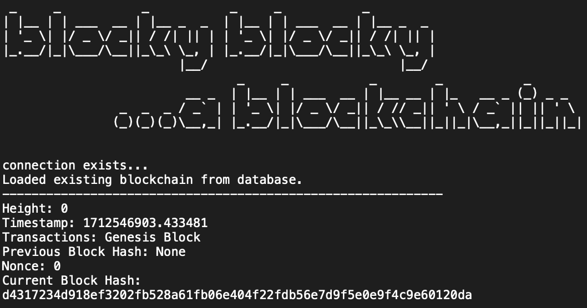

# blocky blocky
A simple, python-based blockchain.

## Block Structure
1. **Block Height (`height`):** Unique number that identifies the position of a block within the overall chain. Higher numbers correspond to newer blocks.

2. **Timestamp (`timestamp`):** UTC time when the block was created.

3. **Transactions (`transactions`):** List of transactions that are included in each block. Each transaction represents a transfer of value between participants in the blockchain network.

4. **Previous Block Hash (`previous_block_hash`):** Cryptographic hash of the previous block in the chain.
    - This link between blocks is what makes the data in the blockchain immutable. If the data in the previous block changes, its hash will change, invalidating all subsequent blocks.

5. **Nonce (`nonce`):** Number found during the proof of work computation that blockchain miners are solving for. Correct value produces a hash that satisfies the blockchain's current difficulty level.

6. **Hash of the Current Block (`current_block_hash`):** Identifier for the current block, created by hashing the block's content, including transactions, the previous block's hash, the timestamp, and the nonce.
    
## Contents
`block.py` contains the Block class, responsible for block creation, including its attributes (timestamp, transactions, previous hash, etc.) and methods (e.g., calculating its own hash).

`blockchain.py` contains the Blockchain class, which manages the chain of blocks. It includes methods for initializing the blockchain, adding new blocks, and verifying the blockchain's integrity.

`transaction.py` **(in progress)** contains the Transaction class, detailing how transactions are created, validated, and processed.

`proof_of_work.py` contains the proof of work algorithm, called by the Blockchain.add_block() method to validate new blocks attempting to join the chain.

`database.py` functions for managing and interacting with a sqlite3 database which provides persistence for the chain.

`network.py` **(in progress)** manages peer-to-peer networking aspects, handling the communication between nodes.

`main.py` orchestrates the interactions between classes and functions to create a functional blockchain.